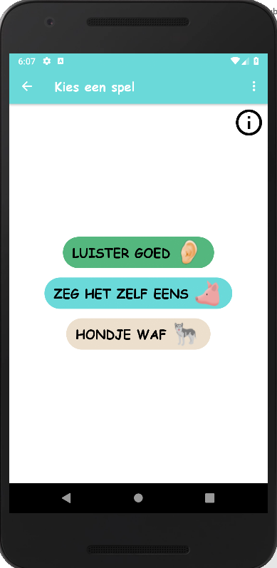

# FlinkSpreken
This is an app that lets children of age 3-6 practise the pronunciation of certain words or sounds. 
It will be used as a bachelor's thesis. The app is designed in dutch because it is specifically targeted at dutch children and dutch words. 

# Download
You can download the APK here: 
http://www.brambleys.be/apk/flinkspreken.apk

# Information and screenshots
<table>
  <tr>
    <th>Welcome screen</th>
    <th>Choose an account</th>
  </tr>
  <tr>
    <td></td>
    <td>
      On this screen you also have the option of deleting and   adding accounts.
       
       
      
    </td>
  </tr>  
  <tr>
    <th>Start screen</th>
    <th>Results</th>
  </tr>
  <tr>
    <td></td>
    <td>
      
    </td>
  </tr>
    <tr>
    <th>Choosing the categories</th>
    <th>Information</th>
  </tr>
  <tr>
    <td>
      This screen gets repeated 3 more times with different   categories to get to your final choice
       
       
      </td>
    <td>
      
    </td>
  </tr>
  <tr>
    <th>Choose a game</th>
    <th>"Luister goed" game</th>
  </tr>
  <tr>
    <td></td>
    <td>
      The child listens to a couple of words, plug in a headset  or earplugs before you begin.
       
       
      
    </td>
  </tr>
  <tr>
    <th>"Zeg het zelf eens" game</th>
    <th>"Zeg het zelf eens" progress</th>
  </tr>
  <tr>
    <td>
      The child presses a pig and gets to see an image. The child   says out loud what it sees on the image. The parent presses   the corresponding image. The child here's a sound or voice   to know if he said the word right or wrong.
       
       
      </td>
    <td>
      
    </td>
  </tr>
  <tr>
    <th>"Hondje waf" game</th>   
  </tr>
  <tr>
    <td>
      The child presses the dog's bone to listen to a word.  At the bottom there's 2 images. The child presses the   image that corresponds to the word it just heard.
       
       
      </td>
  </tr>
</table>

